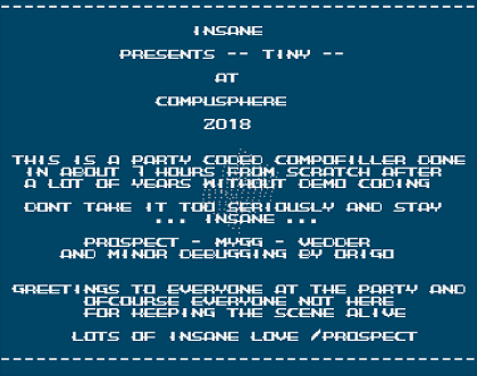

# iNSANE - Tiny - Amiga intro



An Amiga OCS/ECS intro by iNSANE released for Compusphere 2018. 2nd place in Combined intro compo. Written in Motorola 68000 assembly.

Available on [pouet.net](https://www.pouet.net/prod.php?which=79326)

## Prerequisites

- VS Code
- Amiga Assembly extension for VS Code. [https://github.com/prb28/vscode-amiga-assembly](https://github.com/prb28/vscode-amiga-assembly)
- VASM/VLINK. Prebuilt binaries available at [https://github.com/prb28/vscode-amiga-assembly-binaries](https://github.com/prb28/vscode-amiga-assembly-binaries)

## Installing

```bash
> git clone https://github.com/nattfalk/ins-tiny.git
> cd ins-tiny
> git clone --single-branch --branch windows_x64 https://github.com/prb28/vscode-amiga-assembly-binaries.git bin\windows_x64
```

## Usage

Open in VS Code and build and then run (Ctrl+F5). Main code in src/xmas2018.s

## Credits

- Code by me (Prospect) and bug-fixing by my partner in crime ORiGO ;)
- Font by Vedder
- Music by Mygg
- Also a big thumb up to Photon/Scoopex for the startup code

## License

[](http://badges.mit-license.org)

This project is licensed under the MIT License - see the [LICENSE](LICENSE) file for details
